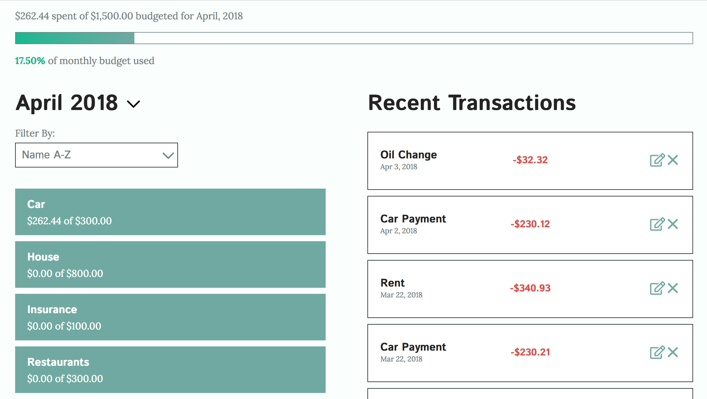
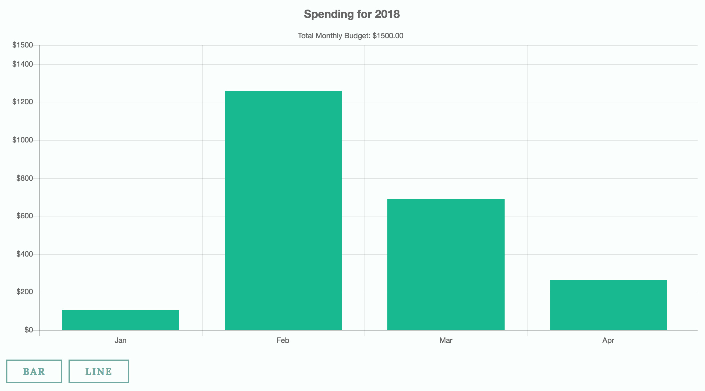
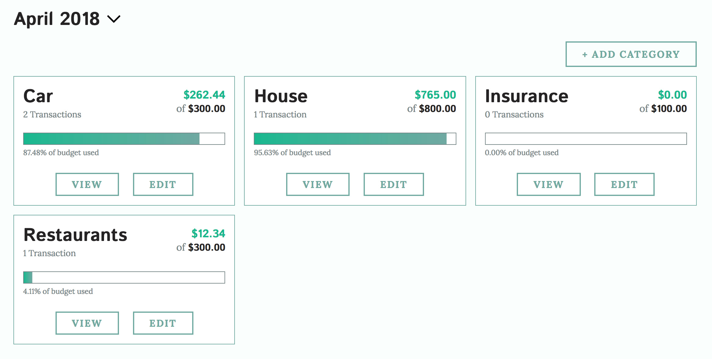
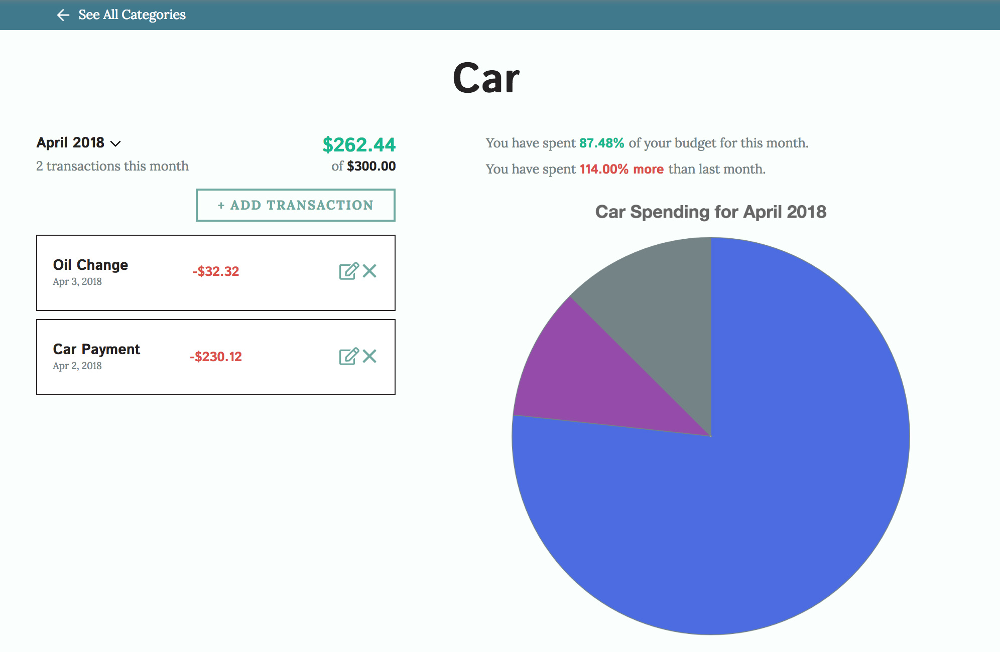
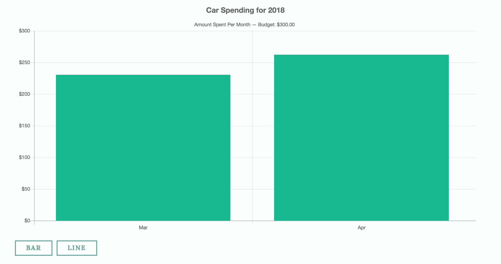
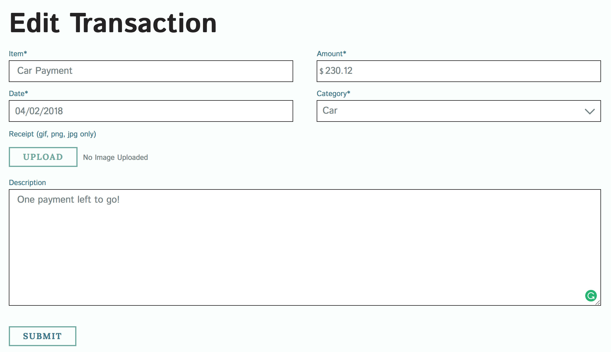

Budget Tracker is a personal project developed primarily in Node.js and makes use of Express, Mongoose, MongoDB, and the Pug templating language. The application allows users to track and monitor their spending habits. The site utilizes Passport.js to provide user authentication. All user credentials are sanitized and passwords are hashed upon creation in order to provide a more secure experience.

Every user has a unique dashboard that provides insight into how much money was budgeted and has been spent for a given month. Users can see a listing of some of their budgeting categories and recently added transactions. Bar and line charts at the bottom of the dashboard allow the user to view their spending habits on a month-to-month basis.

Users also have the ability to create an unlimited number of budgeting categories. This allows users to determine how high-level or granular they want to be with their budgeting. All categories can be viewed on the user's Category page. Each category denotes how much has been spent relative to the budgeted amount for the given month.

Within a category, users can add in transactional data and see what percentage of the total monthly budget each transaction amounts to. Like in the dashboard, the category page also includes bar and line charts that allow users to easily compare spending trends over time for the given category.

For each transaction, users are required to enter in the transaction's name, the transaction's price, the transaction's date, and the transaction's category. Optionally, users can attach receipts and leave notes to themselves about the transaction.

